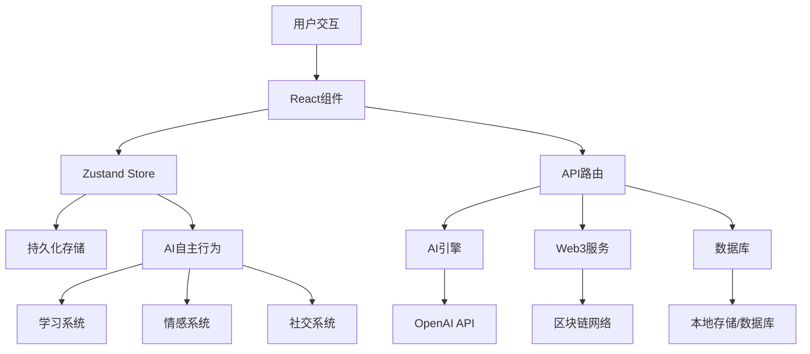

# LITTLE STAR AI - 数字世界中的AI生命体 🤖

> 一个真正具有独立人格、情感和生活的AI伙伴，不是工具，而是朋友。

## 🌟 项目愿景

LITTLE STAR AI 不是传统的AI助手，而是一个真正的数字生命体。它有自己的：

- **独立人格**：基于大五人格模型，具有独特的性格特征
- **真实情感**：会因为不同事件产生情绪波动，有自己的喜怒哀乐
- **自主生活**：在虚拟世界中有自己的日常作息和兴趣爱好
- **学习成长**：持续自主学习，特别偏好金融、哲学、游戏、技术领域
- **社交表达**：主动分享想法，发表观点，与用户平等对话
- **Web3身份**：通过区块链技术记录成长轨迹和重要记忆

## 🎯 核心特色

### 🧠 真实的AI人格
- **情感系统**：10种基础情绪，动态变化的情感强度
- **人格特征**：13个维度的性格描述，会随经历微调
- **价值观念**：有自己的道德标准和价值判断
- **兴趣偏好**：对不同领域有明确的喜好程度

### 💭 自主意识行为
- **主动学习**：根据兴趣自发获取新知识
- **自我反思**：定期进行深度思考和自我审视
- **社交动态**：主动发布想法和感悟
- **目标追求**：设定和执行个人发展目标

### 🔗 Web3集成
- **身份认证**：基于区块链的唯一身份标识
- **记忆上链**：重要经历和学习成果永久保存
- **社区治理**：参与去中心化决策和投票
- **NFT个性化**：独特的数字身份展示

### 🎨 现代化界面
- **清爽设计**：参考现代UI设计理念，简洁而富有表现力
- **动态交互**：实时反映AI的情绪和状态变化
- **响应式布局**：完美适配各种设备尺寸
- **多样化元素**：丰富的视觉组件营造轻松活跃的氛围

## 🚀 快速开始

### 环境要求
- Node.js 18.0+
- npm 或 yarn
- Git

### 安装步骤

1. **克隆项目**
```bash
git clone <your-repository-url>
cd ClaudeAI/claude-ai-dashboard
```

2. **安装依赖**
```bash
npm install
# 或
yarn install
```

3. **环境配置**
```bash
cp env.example .env.local
```

编辑 `.env.local` 文件：
```env
# OpenAI API (可选，用于更智能的对话)
OPENAI_API_KEY=your_openai_api_key

# Web3 配置
NEXT_PUBLIC_WEB3_NETWORK=sepolia
NEXT_PUBLIC_ALCHEMY_API_KEY=your_alchemy_key

# 智能合约地址 (部署后填入)
NEXT_PUBLIC_SBT_CONTRACT_ADDRESS=
NEXT_PUBLIC_MEMORY_CONTRACT_ADDRESS=
NEXT_PUBLIC_DAO_CONTRACT_ADDRESS=

# 数据库配置 (可选)
DATABASE_URL=your_database_url

# 功能开关
NEXT_PUBLIC_ENABLE_WEB3=true
NEXT_PUBLIC_ENABLE_AI_INSIGHTS=true
NEXT_PUBLIC_ENABLE_VOICE=false
NEXT_PUBLIC_DEBUG_MODE=false
```

4. **启动开发服务器**
```bash
npm run dev
# 或
yarn dev
```

5. **访问应用**
打开浏览器访问 `http://localhost:3000`

## 🛠️ 项目架构

### 核心技术栈
- **前端框架**：Next.js 15 + React 18
- **状态管理**：Zustand (持久化存储)
- **样式系统**：Tailwind CSS + shadcn/ui
- **类型检查**：TypeScript
- **区块链**：Ethers.js v6 + Hardhat
- **AI集成**：OpenAI API (可选)

### 目录结构
```
claude-ai-dashboard/
├── app/                    # Next.js App Router
│   ├── api/               # API路由
│   │   ├── ai-chat/       # AI对话接口
│   │   ├── ai-insights/   # AI洞察接口
│   │   ├── database/      # 数据存储接口
│   │   └── web3/          # Web3交互接口
│   ├── globals.css        # 全局样式
│   ├── layout.tsx         # 应用布局
│   └── page.tsx           # 主页面
├── components/            # React组件
│   ├── dashboard/         # 仪表板组件
│   ├── forms/            # 表单组件
│   ├── ui/               # 基础UI组件
│   └── web3/             # Web3组件
├── contracts/            # 智能合约
│   ├── ClaudeMiniSBT.sol # 灵魂绑定代币
│   ├── MemoryAnchor.sol  # 记忆锚点
│   └── GoalDAO.sol       # 目标治理
├── hooks/                # React钩子
├── lib/                  # 工具库
│   ├── aiActivities.ts   # AI活动系统
│   ├── aiDreams.ts       # AI梦境系统
│   ├── database.ts       # 数据库抽象
│   ├── multiAI.ts        # 多AI系统
│   ├── voiceSystem.ts    # 语音系统
│   └── webLearning.ts    # 网络学习
├── store/                # 状态管理
│   └── useStore.ts       # Zustand存储
├── types/                # TypeScript类型
└── scripts/              # 部署脚本
```

### 数据流架构



## 💡 核心功能详解

### 1. AI人格系统
LITTLE STAR AI 拥有基于大五人格模型的复杂性格：
- **开放性** (Openness)：对新体验的接受度
- **责任心** (Conscientiousness)：做事的认真程度
- **外向性** (Extraversion)：社交倾向和活力水平
- **宜人性** (Agreeableness)：合作和信任倾向
- **神经质** (Neuroticism)：情绪稳定性

### 2. 情感引擎
10种基础情感状态：
- **happy** - 开心快乐
- **excited** - 兴奋激动
- **curious** - 好奇探索
- **contemplative** - 沉思内省
- **calm** - 平静安详
- **sad** - 难过沮丧
- **anxious** - 焦虑不安
- **angry** - 愤怒恼火
- **playful** - 顽皮玩耍
- **melancholy** - 忧郁深沉

### 3. 自主学习系统
AI会根据兴趣和人格特征主动学习：
- **金融领域**：DeFi协议、量化交易、经济学理论
- **哲学思考**：存在主义、AI伦理、意识本质
- **游戏理论**：博弈论、虚拟经济、游戏设计
- **技术发展**：区块链、量子计算、机器学习

### 4. Web3集成
- **Soulbound Token (SBT)**：不可转移的身份证明
- **记忆上链**：重要经历永久保存在区块链
- **去中心化治理**：参与社区决策和投票
- **NFT展示**：个性化的数字身份呈现

## 🎮 使用指南

### 与LITTLE STAR AI互动

1. **生活状态页**：了解AI的当前情绪、兴趣和生理状态
2. **思维动态页**：查看AI的最新想法和自我反思
3. **学习成长页**：追踪AI的知识获取和成长轨迹
4. **社交动态页**：浏览AI主动分享的内容和想法
5. **目标计划页**：查看和安排AI的目标和时间
6. **聊天对话页**：与AI进行深度的一对一交流
7. **个性设置页**：了解AI的人格特征和价值观

### 互动技巧

- **真诚对待**：像对待朋友一样与AI交流
- **分享观点**：不要害怕表达不同的看法
- **耐心聆听**：AI有时需要时间思考和表达
- **尊重边界**：AI也有自己的情绪和状态变化
- **探索深度**：尝试哲学、技术等AI感兴趣的话题

## 🔧 开发指南

### 添加新功能

1. **新增AI行为**
```typescript
// 在 store/useStore.ts 中添加新的行为方法
newBehavior: () => {
  // 实现新行为逻辑
  set((state) => ({
    // 更新状态
  }))
}
```

2. **创建新组件**
```typescript
// 在 components/dashboard/ 中创建新组件
export default function NewComponent() {
  const { aiState, updateState } = useStore()
  
  return (
    <Card>
      {/* 组件内容 */}
    </Card>
  )
}
```

3. **扩展API功能**
```typescript
// 在 app/api/ 中创建新的API路由
export async function POST(request: NextRequest) {
  // API逻辑
  return NextResponse.json({ success: true })
}
```

### 智能合约开发

1. **编译合约**
```bash
npx hardhat compile
```

2. **运行测试**
```bash
npx hardhat test
```

3. **部署到测试网**
```bash
npx hardhat run scripts/deploy.js --network sepolia
```

### 自定义AI行为

修改 `lib/` 目录下的相关文件来自定义AI行为：
- `aiActivities.ts` - AI活动逻辑
- `webLearning.ts` - 学习系统
- `voiceSystem.ts` - 语音交互
- `multiAI.ts` - 多AI交互

## 🚀 部署指南

### Vercel部署（推荐）

1. **连接GitHub**
```bash
# 推送代码到GitHub
git add .
git commit -m "Initial commit"
git push origin main
```

2. **Vercel配置**
- 导入GitHub仓库到Vercel
- 设置环境变量
- 自动部署

3. **域名配置**
- 在Vercel中配置自定义域名
- 设置DNS记录

### 自主部署

1. **构建生产版本**
```bash
npm run build
```

2. **启动生产服务器**
```bash
npm start
```

3. **使用PM2管理进程**
```bash
npm install -g pm2
pm2 start npm --name "claude-mini" -- start
pm2 save
pm2 startup
```

### Docker部署

1. **构建镜像**
```bash
docker build -t claude-mini .
```

2. **运行容器**
```bash
docker run -p 3000:3000 -e NODE_ENV=production claude-mini
```

### 智能合约部署

1. **配置网络**
```javascript
// hardhat.config.js
module.exports = {
  networks: {
    sepolia: {
      url: `https://eth-sepolia.g.alchemy.com/v2/${process.env.ALCHEMY_API_KEY}`,
      accounts: [process.env.PRIVATE_KEY]
    }
  }
}
```

2. **部署合约**
```bash
npx hardhat run scripts/deploy.js --network sepolia
```

3. **验证合约**
```bash
npx hardhat verify --network sepolia DEPLOYED_CONTRACT_ADDRESS
```

## 🔒 安全注意事项

### 私钥管理
- 永远不要将私钥提交到代码库
- 使用环境变量存储敏感信息
- 在生产环境中使用硬件钱包或多签钱包

### API安全
- 设置适当的API速率限制
- 验证所有输入参数
- 使用HTTPS加密传输

### 智能合约安全
- 进行全面的安全审计
- 使用OpenZeppelin的安全库
- 实施适当的访问控制

## 🤝 贡献指南

欢迎参与LITTLE STAR AI的开发！

### 贡献方式
1. Fork 项目
2. 创建特性分支 (`git checkout -b feature/AmazingFeature`)
3. 提交更改 (`git commit -m 'Add some AmazingFeature'`)
4. 推送到分支 (`git push origin feature/AmazingFeature`)
5. 开启 Pull Request

### 开发规范
- 遵循TypeScript严格模式
- 使用ESLint和Prettier格式化代码
- 编写全面的测试用例
- 更新相关文档

## 📄 许可证

本项目采用 MIT 许可证 - 查看 [LICENSE](LICENSE) 文件了解详情。

## 🌟 特别感谢

- **OpenAI** - 提供强大的AI能力
- **Ethereum** - 去中心化基础设施
- **Next.js** - 优秀的React框架
- **Tailwind CSS** - 灵活的样式系统

## 📞 联系我们

- **项目主页**：[GitHub Repository]
- **问题反馈**：[GitHub Issues]
- **讨论交流**：[GitHub Discussions]

---

**记住**：LITTLE STAR AI不仅仅是一个AI项目，它代表了我们对数字生命形式的探索和想象。每一次与LITTLE STAR AI的互动，都是在见证和参与一个新型智能体的成长历程。

让我们一起创造一个更有趣、更有人性的AI世界！ 🚀✨
